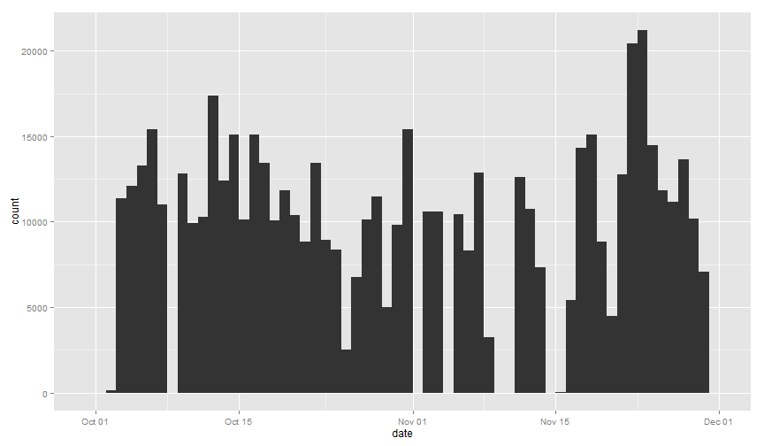
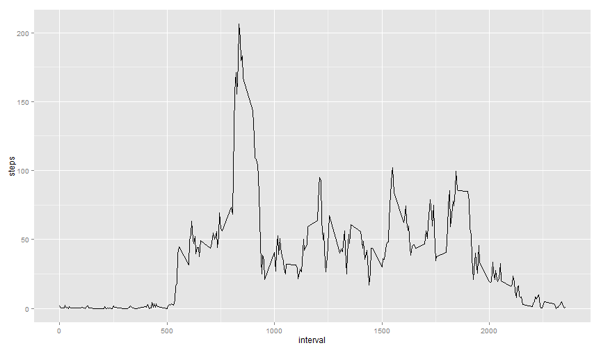
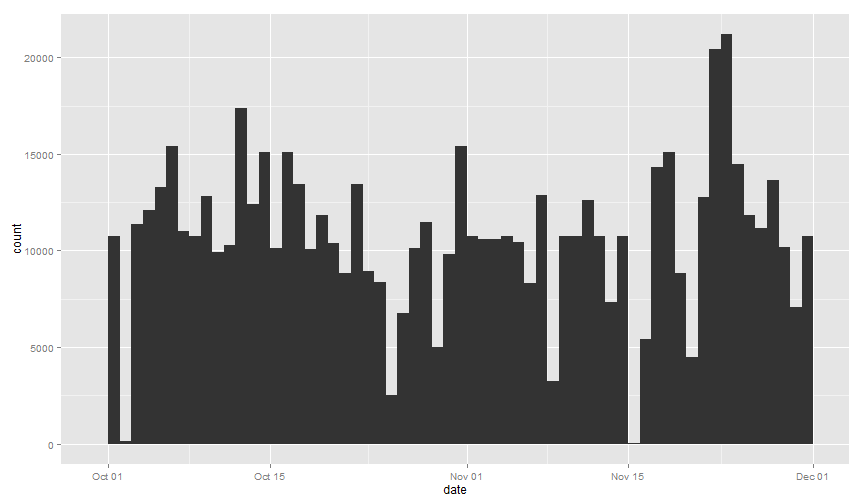
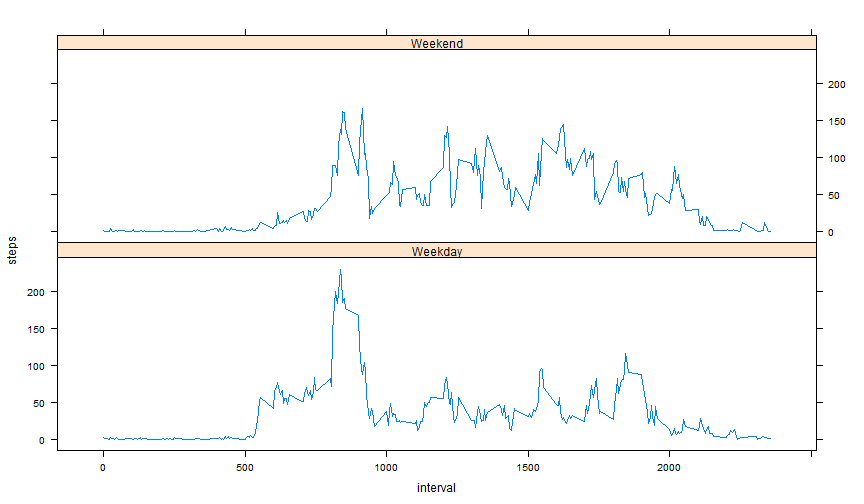

Reproducible Research Assignment 1
======================================


## Loading and preprocessing the data

The data is stored in a csv file and the working directory is set to the file location.


```r
setwd("~/R/Data/Reproducible Research Coursera")
data <- read.csv("activity.csv")
data$date <- as.Date(data$date, format = "%Y-%m-%d")
```

## Histogram

Make a histogram of the total number of steps taken each day.


```r
library("ggplot2")
dailySteps <- aggregate(steps ~ date, data, sum)
ggplot(data,aes(date)) + geom_histogram(aes(weight=steps),binwidth=1)
```

 

## Mean and Median Steps per day

Calculate and report the mean and median total number of steps taken per day.


```r
dMean <- mean(dailySteps$steps)
dMedian <- median(dailySteps$steps)
```
The mean is 1.0766 &times; 10<sup>4</sup>
The median is 10765

## Mean steps per interval

Make a time series plot (i.e. type = "l") of the 5-minute interval (x-axis) and the average number of steps taken, averaged across all days (y-axis).


```r
mInterval <- aggregate(steps ~ interval, data, mean)
ggplot(mInterval, aes(interval,steps)) + geom_line()
```

 

## 5 minute interval with max number of average steps

Which 5-minute interval, on average across all the days in the dataset, contains the maximum number of steps?


```r
maxR <- which.max(mInterval$steps)
maxI <- mInterval$interval[maxR]
maxS <- mInterval$steps[maxR]
```
The max interval average is 835 with 206.1698 steps.

##Missing Values

Calculate and report the total number of missing values in the dataset (i.e. the total number of rows with NAs)


```r
missing <- sum(is.na(data$steps))
```
There are 'r missing' missing values.

## Replace NA's with Mean steps per interval

I used the mean number of steps per interval as replacement.


```r
oldData <- data
fn <- function(steps,interval) ifelse(is.na(steps),mInterval$steps[mInterval$interval==interval],steps)
data$steps <- apply(data[,c("steps","interval")],1, function(y) fn(y["steps"],y["interval"]) )
```
##Histogram with nulls replaced by interval averages


```r
dailySteps2 <- aggregate(steps ~ date, data, sum)
ggplot(data,aes(date)) + geom_histogram(aes(weight=steps),binwidth=1)
```

 
##New Mean and Median


```r
dMean2 <- mean(dailySteps2$steps)
dMedian2 <- median(dailySteps2$steps)
```
##Change in Mean and Median


```r
MeanDiff = dMean2 - dMean
MedianDiff = dMedian2 - dMedian
```
The mean changed by 0 steps and the median changed by 1.1887 steps.

##Days of the week


```r
dowFn <- function(day) ifelse(is.na(match(weekdays(day), c("Saturday","Sunday"))),"Weekday","Weekend")
data$dow <- factor(apply(data["date"],1,function(y) dowFn(as.Date(y["date"]))))
```

##Compute average interval steps for weekends and weekdays


```r
weekend <- data[data$dow=="Weekend",]
weekday <- data[data$dow=="Weekday",]

wkdMean <- aggregate(steps ~ interval, weekday, mean)
wkdMean$dow <- "Weekday"
wkendMean <- aggregate(steps ~ interval, weekend, mean)
wkendMean$dow <- "Weekend"
CombMeans <- rbind(wkdMean,wkendMean)
```

##Weekday versus weekend interval averages


```r
library(lattice)
xyplot(steps ~ interval|dow, data = CombMeans, layout = c(1,2), type = "l")
```

 
